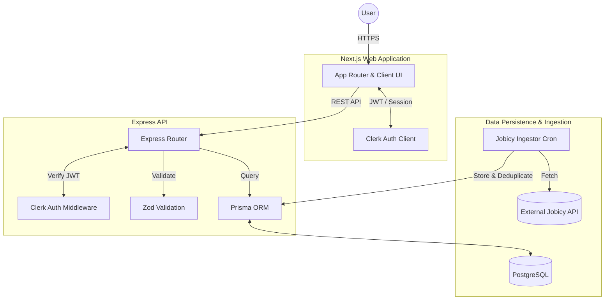

# Career Intelligence Engine 🚀

Career Intelligence is a deterministic matching engine for modern engineering careers. It replaces the traditional "black box" resume-parsing process with a verifiable, evidence-based system that scores candidate capabilities directly against real-world engineering roles. 

Stop searching. Start matching.

---

## 🏗️ System Architecture

The Intelligence Engine is structured as a full-stack TypeScript monorepo, utilizing a decoupled frontend and backend for optimal scalability, clear separation of concerns, and isolated deployments.



### 💻 Technology Stack

**Frontend (`apps/web`)**
*   **Framework:** [Next.js (App Router)](https://nextjs.org/) + React 19
*   **Language:** TypeScript
*   **Authentication:** Clerk (`@clerk/nextjs`)
*   **Styling:** High-performance inline CSS-in-JS variable/token system (No Tailwind or bulky UI frameworks)
*   **Data Fetching:** Native `fetch` with integrated Clerk auth headers and React `useEffect` state synchronization

**Backend (`apps/api`)**
*   **Framework:** [Node.js](https://nodejs.org/) + [Express 5](https://expressjs.com/)
*   **Language:** TypeScript (Executed via `tsx`)
*   **Database:** PostgreSQL
*   **ORM:** [Prisma 7](https://www.prisma.io/) + `@prisma/adapter-pg`
*   **Authentication:** Clerk (`@clerk/express`)
*   **Validation:** Zod for strict runtime schema validation
*   **Ingestion:** Custom ETL scripts (e.g., Jobicy Opportunity Ingestion)

---

## 📂 Monorepo Structure

```text
intelligence-engine/
├── apps/
│   ├── api/                     # Express Backend Core
│   │   ├── prisma/              # Schema definitions and migrations
│   │   ├── src/
│   │   │   ├── routes/          # API Route controllers (e.g., opportunities.ts)
│   │   │   ├── lib/             # Utilities (e.g., prisma client, providers)
│   │   │   └── ingestJobicy.ts  # ETL scripts for opportunity sourcing
│   │   └── package.json
│   │
│   └── web/                     # Next.js Frontend Core
│       ├── app/
│       │   ├── (auth)/          # Authenticated routes & Discovery Workspace
│       │   ├── globals.css      # CSS token variables & base animations
│       │   └── layout.tsx       # Root layout & providers
│       ├── components/          # Reusable, zero-dependency UI primitives
│       ├── lib/                 # Shared types and API fetching utilities
│       └── package.json
```

---

## 🧠 Core Subsystems

### 1. Authentication & Security
We utilize **Clerk** as an identity provider. The frontend securely handles session state via `@clerk/nextjs`, seamlessly wrapping API requests with short-lived JWTs. The Express backend employs `@clerk/express` middleware to intercept, decode, and strictly authorize incoming requests before hitting the controllers.

### 2. Opportunity Ingestion Engine
To power the Discovery Workspace, the system implements a robust internal ETL pipeline (`ingest:jobicy`). It pulls remote data from external REST APIs (Jobicy), normalizes the payload into a unified `Opportunity` type, deduplicates records, and securely commits them to PostgreSQL via Prisma.

### 3. API & Data Validation
All backend API routes are strictly protected by **Zod**. Every incoming query parameter (e.g., pagination constraints, filter types) and request body is parsed and validated against deterministic schemas. If a request includes malformed data, it is rejected at the edge with a clean HTTP 400 error before ever reaching the database.

### 4. Custom UI / Design System
The frontend employs a proprietary design system explicitly engineered for data-dense, technical analytics products:
- **Core Theme:** Warm off-white canvas (`--bg-primary`), near-black typography, and strict borders.
- **Security-First Rendering:** External HTML payloads (like job descriptions) are safely sanitized on the client-side using `DOMParser` to strip `<iframe>`, `<script>`, and dangerous `javascript:` schemas, ensuring XSS immunity without bloat.
- **Zero CSS Bloat:** Built with a proprietary set of `ui/` primitives (`Button`, `Card`, `Badge`) utilizing inline React CSS properties combined with root CSS variables, ensuring lightning-fast client render times and extreme customizability.

---

## 🚀 Local Development Setup

### Prerequisites
*   Node.js (v20+ recommended)
*   npm
*   Docker (for local PostgreSQL instance)
*   A [Clerk](https://clerk.com/) account for Auth keys

### Installation

1.  **Clone the repository**
    ```bash
    git clone https://github.com/your-org/intelligence-engine.git
    cd intelligence-engine
    ```

2.  **Install dependencies**
    ```bash
    cd apps/api && npm install
    cd ../web && npm install
    ```

3.  **Environment Variables**
    Create a `.env` file in both `apps/api` and `apps/web` referencing their respective `.env.example` templates. Ensure your Clerk keys and Postgres `DATABASE_URL` are set.

4.  **Database Initialization**
    Start a local Postgres instance, then push the schema:
    ```bash
    cd apps/api
    npx prisma generate
    npx prisma db push
    ```

5.  **Run Development Servers**
    Start both the frontend and backend servers concurrently.
    ```bash
    # Terminal 1: Backend API
    cd apps/api
    npm run dev

    # Terminal 2: Next.js Frontend
    cd apps/web
    npm run dev
    ```
    - Web UI: `http://localhost:3000`
    - API Server: `http://localhost:3001`

---

## 📄 License

This project is proprietary and confidential. Unauthorized copying, distribution, or usage of this codebase is strictly prohibited.
*Built for the modern candidate.*
